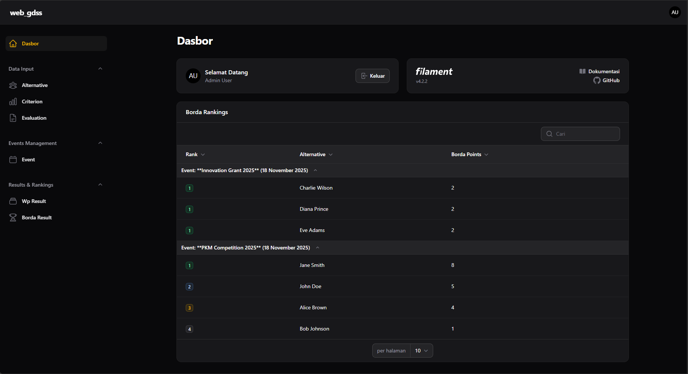
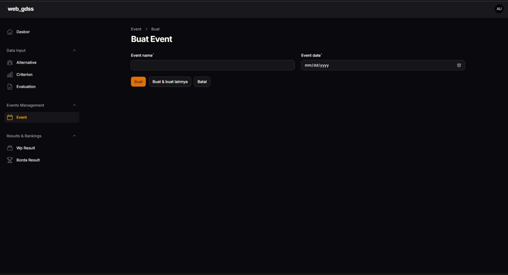
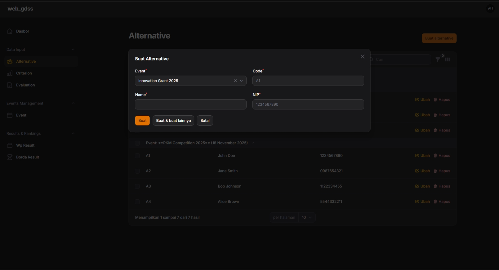
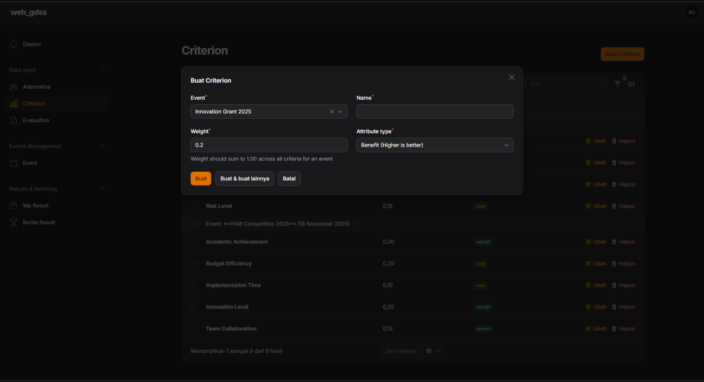
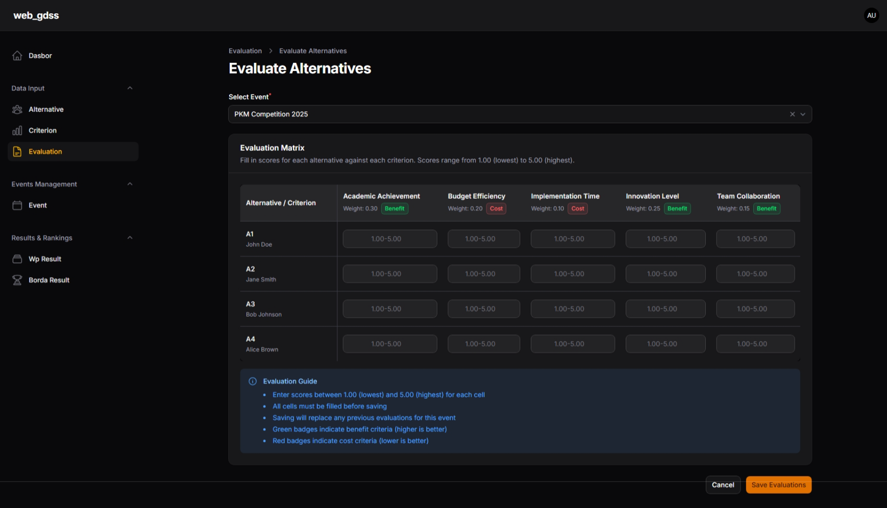

# Web GDSS v2 - Group Decision Support System


A comprehensive web-based Group Decision Support System (GDSS) built with Laravel 12 and Filament 4. This application facilitates collaborative decision-making processes by implementing advanced multi-criteria decision analysis (MCDA) algorithms including Weighted Product (WP) and Borda Count aggregation methods.

## Table of Contents

-   [Project Overview](#project-overview)
-   [Features](#features)
    -   [Core Decision Support Capabilities](#core-decision-support-capabilities)
    -   [Advanced Algorithms](#advanced-algorithms)
    -   [User Interface](#user-interface)
    -   [Technical Features](#technical-features)
-   [Technology Stack](#technology-stack)
    -   [Backend](#backend)
    -   [Frontend & Admin Panel](#frontend--admin-panel)
    -   [Development Tools](#development-tools)
-   [Getting Started](#getting-started)
    -   [Prerequisites](#prerequisites)
    -   [Installation](#installation)
    -   [Running the Application](#running-the-application)
-   [Usage](#usage)
    -   [For Administrators](#for-administrators)
    -   [For Decision Makers](#for-decision-makers)
    -   [Mathematical Methods](#mathematical-methods)
-   [Project Structure](#project-structure)
-   [Contributing](#contributing)
    -   [Development Workflow](#development-workflow)
    -   [Code Standards](#code-standards)
    -   [Testing](#testing)
-   [Security](#security)
    -   [Reporting Vulnerabilities](#reporting-vulnerabilities)
    -   [Security Best Practices](#security-best-practices)
    -   [Recommended Production Setup](#recommended-production-setup)
-   [License](#license)
-   [Credits](#credits)
    -   [Built With](#built-with)
    -   [Algorithms & Methods](#algorithms--methods)
    -   [Development Team](#development-team)
-   [Need Support?](#need-support)
    -   [Getting Help](#getting-help)
    -   [Useful Resources](#useful-resources)

## Project Overview

Web GDSS v2 is designed to help organizations make data-driven, collaborative decisions by systematically evaluating multiple alternatives against defined criteria. The system enables multiple decision makers to independently evaluate alternatives, then aggregates their individual rankings into a final group consensus using proven mathematical methods.

## Features

### Core Decision Support Capabilities

-   **Event Management**: Create and manage decision-making events with specific dates and assigned decision makers
-   **Alternative Management**: Define and track alternatives (candidates, options, proposals) for evaluation with unique codes and identifiers
-   **Criteria Management**: Configure weighted evaluation criteria with benefit/cost attribute types
-   **Multi-User Evaluations**: Support for multiple decision makers to independently evaluate alternatives on a numeric scale (1-5)
-   **Automated Calculation Engine**: Transaction-safe computation of individual and group rankings

### Advanced Algorithms

-   **Weighted Product (WP) Method**:
    -   Calculates S-vectors using power-weighted scores
    -   Normalizes to V-vectors for relative preference values
    -   Assigns individual rankings per decision maker using Standard Competition Ranking
-   **Borda Count Aggregation**:
    -   Aggregates individual rankings into group consensus
    -   Calculates total Borda points for each alternative
    -   Produces final ranked recommendations using Standard Competition Ranking (1-2-2-4 format)

### User Interface

-   **Admin Panel**: Full-featured Filament 4 administrative interface
-   **Role-Based Access Control**: Separate permissions for administrators and decision makers
-   **Dashboard Widgets**: Real-time visualization of Borda rankings with filtering capabilities
-   **Resource Management**: CRUD operations for Events, Alternatives, Criteria, and Evaluations
-   **Relation Managers**: Intuitive interfaces for managing event-scoped data
-   **Data Validation**: Comprehensive validation ensuring evaluation completeness before calculations

### Technical Features

-   **Strict Type Safety**: Full PHP 8.2 strict typing throughout the codebase
-   **Database Transactions**: ACID-compliant calculations with automatic rollback on errors
-   **Idempotent Operations**: Safe re-calculation of results without data duplication
-   **Factory & Seeder Support**: Complete test data generation capabilities
-   **PHPUnit Testing**: Comprehensive test suite included

## Technology Stack

### Backend

-   **Laravel 12**: PHP web application framework with modern features
-   **PHP 8.2+**: Latest PHP version with strict typing and performance improvements
-   **MySQL/MariaDB**: Primary database system

### Frontend & Admin Panel

-   **Filament 4**: Full-stack admin panel builder with advanced UI components
-   **Livewire**: Server-side reactive components
-   **Alpine.js**: Lightweight JavaScript framework
-   **Tailwind CSS 4**: Utility-first CSS framework

### Development Tools

-   **Vite**: Modern build tool for frontend assets
-   **Laravel Pint**: PHP code style fixer
-   **PHPUnit**: PHP testing framework
-   **Laravel Pail**: Log viewer for development

## Getting Started

### Prerequisites

Before installing, ensure you have the following installed on your system:

-   **PHP**: Version 8.2 or higher
-   **Composer**: Latest version for dependency management
-   **Node.js**: Version 18 or higher with npm
-   **Database**: MySQL 5.7+ or MariaDB 10.3+
-   **Web Server**: Apache or Nginx (optional for local development)

### Installation

1. **Clone the repository**

    ```bash
    git clone https://github.com/Efrosine/web-gdss.git
    cd web-gdss
    ```

2. **Install dependencies**

    ```bash
    composer install
    npm install
    ```

3. **Environment configuration**

    ```bash
    cp .env.example .env
    php artisan key:generate
    ```

4. **Configure your database**

    Edit the `.env` file with your database credentials:

    ```env
    DB_CONNECTION=mysql
    DB_HOST=127.0.0.1
    DB_PORT=3306
    DB_DATABASE=web_gdss_v2
    DB_USERNAME=root
    DB_PASSWORD=your_password
    ```

5. **Run database migrations**

    ```bash
    php artisan migrate
    ```

6. **Build frontend assets**

    ```bash
    npm run build
    ```

7. **Create admin user**

    ```bash
    php artisan make:filament-user
    ```

8. **(Optional) Seed sample data**
    ```bash
    php artisan db:seed
    ```

### Running the Application

#### Development Mode

Run all services concurrently (server, queue, logs, and Vite):

```bash
composer run dev
```

This command starts:

-   Laravel development server at `http://localhost:8000`
-   Queue worker for background jobs
-   Real-time log viewer (Pail)
-   Vite development server with hot reload

#### Production Mode

```bash
php artisan serve
npm run build
```

Access the admin panel at: `http://localhost:8000/admin`

## Usage

### For Administrators

1. **Create an Event**
    - Navigate to Events Management → Events - Click "New Event" and provide event name and date - Save the event

2. **Define Alternatives**
    - Open the event detail page - Navigate to the "Alternatives" tab - Add alternatives with codes (A1, A2, etc.), names, and identifiers

3. **Configure Criteria**
    - Navigate to the "Criteria" tab - Add criteria with names, weights (decimal values), and attribute types: - **Benefit**: Higher scores are better (e.g., experience, quality) - **Cost**: Lower scores are better (e.g., price, risk)

4. **Assign Decision Makers**

    - Navigate to the "Users" tab
    - Assign decision makers who will evaluate the alternatives

5. **Run Calculation**
    - Once all evaluations are complete, click "Run Calculation" action - View results in the Borda Rankings widget on the dashboard

### For Decision Makers

1. **Access Assigned Events**

    - Log in to the admin panel
    - View events you've been assigned to in Evaluations

2. **Submit Evaluations**

    - Navigate to Evaluations → Create
    - Select the event
    - Rate each alternative against each criterion on a scale of 1-5
    - Save evaluations

3. **View Rankings**
    - Access the dashboard to view final Borda rankings
    - Filter results by specific events

### Mathematical Methods

#### Weighted Product (WP)

For each decision maker and alternative, the system calculates:

**S-Vector**: $S_{ua} = \prod_{j=1}^{n} (Score_{uaj})^{P_j}$

Where:

-   $P_j = |W_j|$ for benefit criteria
-   $P_j = -|W_j|$ for cost criteria

**V-Vector** (Normalized): $V_{ua} = \frac{S_{ua}}{\sum_{all\ alternatives} S_{u}}$

#### Borda Count

**Points Assignment**: $Points = (Total\ Alternatives - Rank)$

The alternative with the highest total Borda points receives Rank 1.

## Project Structure

```
web-gdss-v2/
├── app/
│   ├── Filament/           # Admin panel resources and widgets
│   │   ├── Resources/      # CRUD resources for all models
│   │   └── Widgets/        # Dashboard widgets
│   ├── Http/               # Controllers and middleware
│   ├── Models/             # Eloquent models
│   │   ├── Event.php       # Event model
│   │   ├── Alternative.php # Alternative model
│   │   ├── Criterion.php   # Criterion model
│   │   ├── Evaluation.php  # Evaluation model
│   │   ├── WpResult.php    # WP calculation results
│   │   └── BordaResult.php # Borda aggregation results
│   ├── Policies/           # Authorization policies
│   └── Services/           # Business logic services
│       └── DecisionSupportService.php  # Core calculation engine
├── database/
│   ├── migrations/         # Database schema definitions
│   ├── factories/          # Model factories for testing
│   └── seeders/            # Database seeders
├── docs/                   # Additional documentation
│   ├── architecture.md     # System architecture overview
│   └── service_strategy.md # Algorithm implementation details
├── resources/
│   ├── views/              # Blade templates
│   ├── css/                # Stylesheets
│   └── js/                 # JavaScript files
├── routes/                 # Application routes
├── tests/                  # PHPUnit test suite
└── public/                 # Public assets
```

## Contributing

We welcome contributions to improve Web GDSS v2! Here's how you can help:

### Development Workflow

1. **Fork the repository** and clone it locally
2. **Create a feature branch**: `git checkout -b feature/your-feature-name`
3. **Make your changes** with clear, descriptive commit messages
4. **Write/update tests** for new functionality
5. **Run the test suite**: `composer run test`
6. **Check code style**: `./vendor/bin/pint`
7. **Submit a pull request** with a clear description of changes

### Code Standards

-   Follow **PSR-12** coding standards
-   Use **strict typing** (`declare(strict_types=1);`) in all PHP files
-   Write **comprehensive PHPUnit tests** for new features
-   Add **DocBlocks** for all public methods
-   Ensure **database transactions** for data-modifying operations
-   Maintain **idempotency** in calculation methods

### Testing

Run the test suite to ensure all tests pass:

```bash
php artisan test
```

Run with coverage report:

```bash
php artisan test --coverage
```

## Security

### Reporting Vulnerabilities

If you discover a security vulnerability within Web GDSS v2, please send an email to the project maintainers. Please do not create a public GitHub issue for security vulnerabilities.

**Response Time**: We aim to respond to security reports within 48 hours and provide a fix within 7 days for critical vulnerabilities.

### Security Best Practices

-   All passwords are hashed using bcrypt (configurable rounds)
-   Role-based access control restricts data access
-   Database transactions prevent data corruption
-   CSRF protection enabled on all forms
-   SQL injection prevention through Eloquent ORM
-   Input validation on all user submissions

### Recommended Production Setup

-   Use HTTPS for all connections
-   Enable `APP_DEBUG=false` in production
-   Set strong `APP_KEY` value
-   Restrict database user permissions
-   Keep dependencies updated regularly
-   Enable application logging and monitoring

## License

Web GDSS v2 is open-source software licensed under the **MIT License**.

### MIT License

Copyright (c) 2025 Web GDSS v2 Contributors

Permission is hereby granted, free of charge, to any person obtaining a copy of this software and associated documentation files (the "Software"), to deal in the Software without restriction, including without limitation the rights to use, copy, modify, merge, publish, distribute, sublicense, and/or sell copies of the Software, and to permit persons to whom the Software is furnished to do so, subject to the following conditions:

The above copyright notice and this permission notice shall be included in all copies or substantial portions of the Software.

THE SOFTWARE IS PROVIDED "AS IS", WITHOUT WARRANTY OF ANY KIND, EXPRESS OR IMPLIED, INCLUDING BUT NOT LIMITED TO THE WARRANTIES OF MERCHANTABILITY, FITNESS FOR A PARTICULAR PURPOSE AND NONINFRINGEMENT. IN NO EVENT SHALL THE AUTHORS OR COPYRIGHT HOLDERS BE LIABLE FOR ANY CLAIM, DAMAGES OR OTHER LIABILITY, WHETHER IN AN ACTION OF CONTRACT, TORT OR OTHERWISE, ARISING FROM, OUT OF OR IN CONNECTION WITH THE SOFTWARE OR THE USE OR OTHER DEALINGS IN THE SOFTWARE.

## Credits

### Built With

-   **[Laravel](https://laravel.com/)** - The PHP framework for web artisans
-   **[Filament](https://filamentphp.com/)** - Beautiful admin panel builder for Laravel
-   **[Livewire](https://livewire.laravel.com/)** - Full-stack framework for Laravel
-   **[Tailwind CSS](https://tailwindcss.com/)** - Utility-first CSS framework
-   **[Alpine.js](https://alpinejs.dev/)** - Lightweight JavaScript framework

### Algorithms & Methods

This project implements decision support algorithms based on established multi-criteria decision analysis (MCDA) research:

-   Weighted Product Method (WPM) for individual preference calculation
-   Borda Count for group decision aggregation
-   Standard Competition Ranking for tie handling

### Development Team

-   Project maintained and developed as part of decision support system research

## Need Support?

### Getting Help

If you need assistance or have questions:

1. **Documentation**: Review the `/docs` folder for detailed architecture and algorithm documentation

    - `docs/architecture.md` - System architecture and database schema
    - `docs/service_strategy.md` - Algorithm implementation details

2. **GitHub Issues**: For bug reports and feature requests

    - Check existing issues before creating new ones
    - Provide detailed reproduction steps for bugs
    - Include system information (PHP version, database, OS)

3. **Discussions**: For general questions and community support
    - Share use cases and implementation experiences
    - Ask questions about decision-making methods
    - Suggest improvements and new features

### Useful Resources

-   [Laravel 12 Documentation](https://laravel.com/docs/12.x)
-   [Filament 4 Documentation](https://filamentphp.com/docs/4.x)
-   [Multi-Criteria Decision Analysis](https://en.wikipedia.org/wiki/Multiple-criteria_decision_analysis)

---

**Version**: 2.0  
**Last Updated**: November 2025  
**Minimum Requirements**: PHP 8.2, Laravel 12, Filament 4
